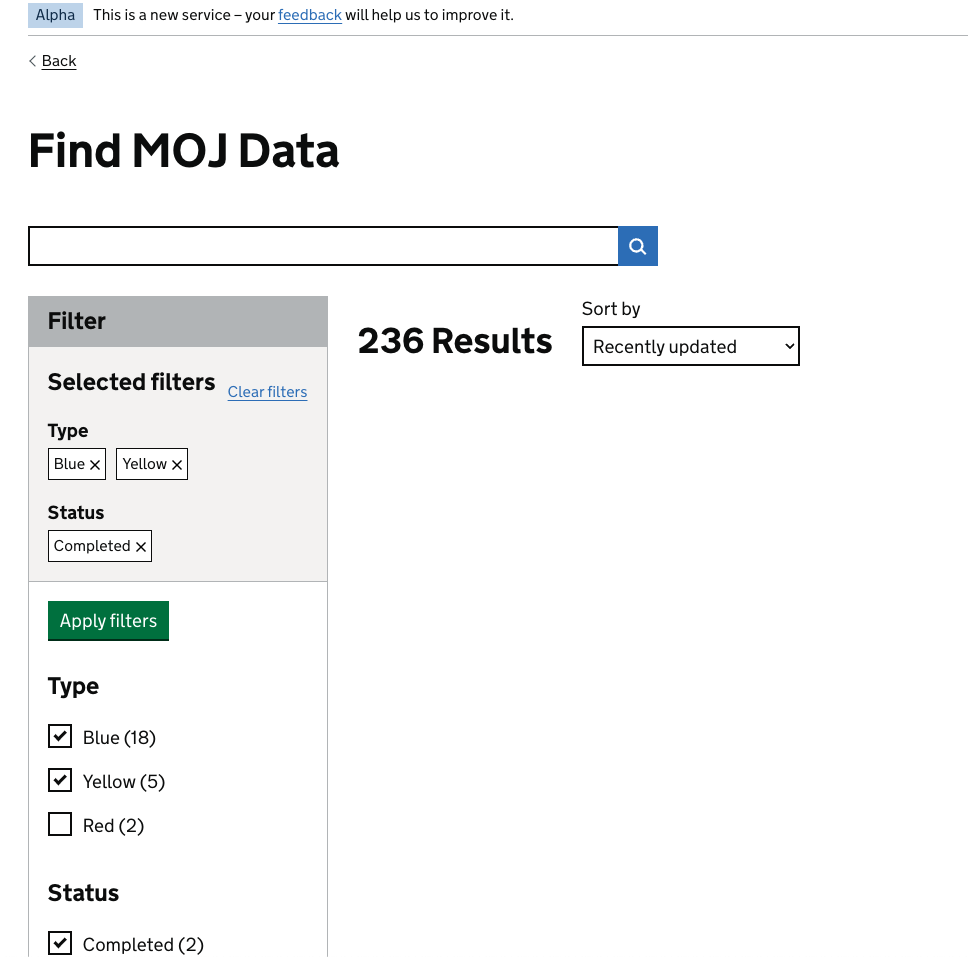

## Quick start

You will need npm (for javascript dependencies) and poetry (for python dependencies).

1. Run `poetry install` to install python dependencies
2. Copy `.env.example` to `.env`.
3. You wil need to obtain an access token from Datahub catalogue and populate the
   `CATALOGUE_TOKEN` var in .env to be able to retrieve search data.
4. Run `poetry run python manage.py runserver`

Run `npm install` and then `npm run sass` to compile the stylesheets.

## Current Endpoints

/search

## Contributing

Run `pre-commit install` from inside the poetry environment to set up pre commit hooks.

- Linting and formatting handled by `black`, `flake8`, `djlint`, `pre-commit`, and `isort`
  - `isort` and `djlint` are configured in `pyproject.toml`
- `detect-secrets` is used to prevent leakage of secrets
- `sync_with_poetry` ensures the versions of the modules in the pre-commit specification
  are kept in line with those in the `pyproject.toml` config.

## Testing

- Python unit tests: `pytest -m 'not slow'`
- Javascript unit tests: `npm test`
- Selenium tests: `pytest -m 'slow'`
