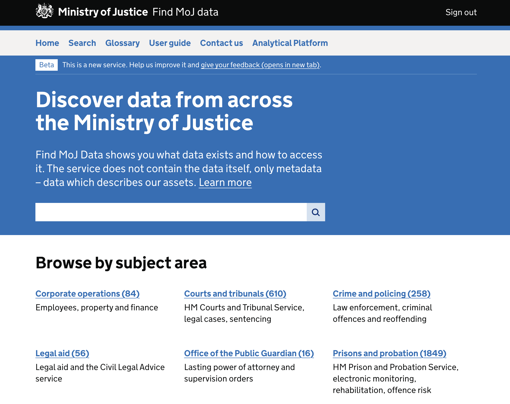

# Find MOJ Data

[![repo standards badge](https://img.shields.io/endpoint?labelColor=231f20&color=005ea5&style=for-the-badge&label=MoJ%20Compliant&url=https%3A%2F%2Foperations-engineering-reports.cloud-platform.service.justice.gov.uk%2Fapi%2Fv1%2Fcompliant_public_repositories%2Fendpoint%2Ffind-moj-data&logo=data:image/png;base64,iVBORw0KGgoAAAANSUhEUgAAACgAAAAoCAYAAACM/rhtAAAABmJLR0QA/wD/AP+gvaeTAAAHJElEQVRYhe2YeYyW1RWHnzuMCzCIglBQlhSV2gICKlHiUhVBEAsxGqmVxCUUIV1i61YxadEoal1SWttUaKJNWrQUsRRc6tLGNlCXWGyoUkCJ4uCCSCOiwlTm6R/nfPjyMeDY8lfjSSZz3/fee87vnnPu75z3g8/kM2mfqMPVH6mf35t6G/ZgcJ/836Gdug4FjgO67UFn70+FDmjcw9xZaiegWX29lLLmE3QV4Glg8x7WbFfHlFIebS/ANj2oDgX+CXwA9AMubmPNvuqX1SnqKGAT0BFoVE9UL1RH7nSCUjYAL6rntBdg2Q3AgcAo4HDgXeBAoC+wrZQyWS3AWcDSUsomtSswEtgXaAGWlVI2q32BI0spj9XpPww4EVic88vaC7iq5Hz1BvVf6v3qe+rb6ji1p3pWrmtQG9VD1Jn5br+Knmm70T9MfUh9JaPQZu7uLsR9gEsJb3QF9gOagO7AuUTom1LpCcAkoCcwQj0VmJregzaipA4GphNe7w/MBearB7QLYCmlGdiWSm4CfplTHwBDgPHAFmB+Ah8N9AE6EGkxHLhaHU2kRhXc+cByYCqROs05NQq4oR7Lnm5xE9AL+GYC2gZ0Jmjk8VLKO+pE4HvAyYRnOwOH5N7NhMd/WKf3beApYBWwAdgHuCLn+tatbRtgJv1awhtd838LEeq30/A7wN+AwcBt+bwpD9AdOAkYVkpZXtVdSnlc7QI8BlwOXFmZ3oXkdxfidwmPrQXeA+4GuuT08QSdALxC3OYNhBe/TtzON4EziZBXD36o+q082BxgQuqvyYL6wtBY2TyEyJ2DgAXAzcC1+Xxw3RlGqiuJ6vE6QS9VGZ/7H02DDwAvELTyMDAxbfQBvggMAAYR9LR9J2cluH7AmnzuBowFFhLJ/wi7yiJgGXBLPq8A7idy9kPgvAQPcC9wERHSVcDtCfYj4E7gr8BRqWMjcXmeB+4tpbyG2kG9Sl2tPqF2Uick8B+7szyfvDhR3Z7vvq/2yqpynnqNeoY6v7LvevUU9QN1fZ3OTeppWZmeyzRoVu+rhbaHOledmoQ7LRd3SzBVeUo9Wf1DPs9X90/jX8m/e9Rn1Mnqi7nuXXW5+rK6oU7n64mjszovxyvVh9WeDcTVnl5KmQNcCMwvpbQA1xE8VZXhwDXAz4FWIkfnAlcBAwl6+SjD2wTcmPtagZnAEuA3dTp7qyNKKe8DW9UeBCeuBsbsWKVOUPvn+MRKCLeq16lXqLPVFvXb6r25dlaGdUx6cITaJ8fnpo5WI4Wuzcjcqn5Y8eI/1F+n3XvUA1N3v4ZamIEtpZRX1Y6Z/DUK2g84GrgHuDqTehpBCYend94jbnJ34DDgNGArQT9bict3Y3p1ZCnlSoLQb0sbgwjCXpY2blc7llLW1UAMI3o5CD4bmuOlwHaC6xakgZ4Z+ibgSxnOgcAI4uavI27jEII7909dL5VSrimlPKgeQ6TJCZVQjwaOLaW8BfyWbPEa1SaiTH1VfSENd85NDxHt1plA71LKRvX4BDaAKFlTgLeALtliDUqPrSV6SQCBlypgFlbmIIrCDcAl6nPAawmYhlLKFuB6IrkXAadUNj6TXlhDcCNEB/Jn4FcE0f4UWEl0NyWNvZxGTs89z6ZnatIIrCdqcCtRJmcCPwCeSN3N1Iu6T4VaFhm9n+riypouBnepLsk9p6p35fzwvDSX5eVQvaDOzjnqzTl+1KC53+XzLINHd65O6lD1DnWbepPBhQ3q2jQyW+2oDkkAtdt5udpb7W+Q/OFGA7ol1zxu1tc8zNHqXercfDfQIOZm9fR815Cpt5PnVqsr1F51wI9QnzU63xZ1o/rdPPmt6enV6sXqHPVqdXOCe1rtrg5W7zNI+m712Ir+cer4POiqfHeJSVe1Raemwnm7xD3mD1E/Z3wIjcsTdlZnqO8bFeNB9c30zgVG2euYa69QJ+9G90lG+99bfdIoo5PU4w362xHePxl1slMab6tV72KUxDvzlAMT8G0ZohXq39VX1bNzzxij9K1Qb9lhdGe931B/kR6/zCwY9YvuytCsMlj+gbr5SemhqkyuzE8xau4MP865JvWNuj0b1YuqDkgvH2GkURfakly01Cg7Cw0+qyXxkjojq9Lw+vT2AUY+DlF/otYq1Ixc35re2V7R8aTRg2KUv7+ou3x/14PsUBn3NG51S0XpG0Z9PcOPKWSS0SKNUo9Rv2Mmt/G5WpPF6pHGra7Jv410OVsdaz217AbkAPX3ubkm240belCuudT4Rp5p/DyC2lf9mfq1iq5eFe8/lu+K0YrVp0uret4nAkwlB6vzjI/1PxrlrTp/oNHbzTJI92T1qAT+BfW49MhMg6JUp7ehY5a6Tl2jjmVvitF9fxo5Yq8CaAfAkzLMnySt6uz/1k6bPx59CpCNxGfoSKA30IPoH7cQXdArwCOllFX/i53P5P9a/gNkKpsCMFRuFAAAAABJRU5ErkJggg==)](https://operations-engineering-reports.cloud-platform.service.justice.gov.uk/public-report/find-moj-data)

Find MOJ Data is an internal service for finding and sharing data across the Ministry of Justice.
It is powered by Datahub, an open source data catalogue. This repository contains a custom UI that
uses the GOV.UK design system, and focuses on data discovery.



## Quick start

Please refer to Prerequisites for dependencies and installation instructions

1. Run `poetry install` to install python dependencies
1. Run `npm install` to download frontend static dependencies.
1. Set the `ENV` var to `local` i.e. `export ENV=local`
1. Run `op inject --in-file .env.tpl --out-file .env` to generate a compatible `.env` file
1. Optionally substitute value for `CATALOGUE_TOKEN` var in .env with your own PAT value to be able to retrieve search data.
1. Run `poetry run python manage.py collectstatic --noinput` to collect static files
1. Run `poetry run python manage.py migrate` this will create a local sqlite3 database and migrate any tables
1. Run `poetry run python manage.py waffle_switch search-sort-radio-buttons off --create` to setup the waffle switch tables
1. Run `poetry run python manage.py waffle_switch display-result-tags off --create` to setup the waffle switch for tags
1. Run `poetry run python manage.py runserver`

```sh
poetry install --no-root
npm install
export ENV=local
op inject --in-file .env.tpl --out-file .env
poetry run python manage.py collectstatic --noinput
poetry run python manage.py migrate
poetry run python manage.py waffle_switch search-sort-radio-buttons off --create
poetry run python manage.py runserver
```

# Running the app against the RDS database(s)
The database settings in the application are such that for local development an sqlite db will be created.
However if there is a usecase to target one of the RDS environments then you will need to carry out the following steps.
It is important to note that to access the rds environment you will need to create a loopback connection which means opening a local free
port on your machine for the postgres connection, the loopback connection then forwards matching traffic to a dedicated port forward pod, which inturn forwards
to the specified rds environment. Please pay particular attention to the port numbers that have been specified in the examples. We have used port 1234 for
the local port.

1) Create a loop back pod for the given namespace. Note all ports are standard postgres port 5432 for this command.
    ```
    kubectl -n data-platform-find-moj-data-dev \
    run port-forward-pod \
    --image=ministryofjustice/port-forward \
    --port=5432 \
    --env="REMOTE_HOST=cloud-platform-2d5acdf1ab5379e3.cdwm328dlye6.eu-west-2.rds.amazonaws.com" \
    --env="LOCAL_PORT=5432" \
    --env="REMOTE_PORT=5432"
    ```
2) Forward traffic from your local host to the remote pod and keep the connection open. Note the use of local port of 1234.

    ```
    kubectl -n data-platform-find-moj-data-dev port-forward port-forward-pod 1234:5432
    ```
3) You can test connectivity as follows using postgres utility psql.Note the use of localhost and local port 1234.

    ```
    psql postgres://< Database Username >:< Database Password >@localhost:1234/< Database Name >
    ```
    ```
    psql (14.11 (Homebrew), server 16.3)
    WARNING: psql major version 14, server major version 16.
            Some psql features might not work.
    SSL connection (protocol: TLSv1.3, cipher: TLS_AES_256_GCM_SHA384, bits: 256, compression: off)
    Type "help" for help.

    db2d5acdf1ab5379e3=>
    ```

4) Via Netcat. Note the use of localhost and local port 1234.

    ```
    nc -z localhost 1234
    ```
    ```
    Connection to localhost port 1234 [tcp/search-agent] succeeded!
    ```

5) Optionally populate the .env file if you dont already have one. Add additional environment variables required for RDS.
Note the value of `RDS_INSTANCE_ADDRESS` as `docker.for.mac.host.internal`. This is a special requirment for accessing local connections through docker containers on MAC OS.

    ```
    op inject --in-file .env.tpl --out-file .env
    ```

    ```
    RDS_INSTANCE_ADDRESS=docker.for.mac.host.internal
    DATABASE_NAME=< 1pass >
    DATABASE_USERNAME=< 1pass >
    DATABASE_PASSWORD=< 1pass >
    ```

6) In order for the application to utilise the loopback connection you have created in the steps above, you will need to change the postgres port number in the Django settings file `settings.py` and addionally in the startup script ```./scripts/app-entrypoint.sh` if you are running as a docker image, to match the local port value used for the loopback connection i.e. `1234` in our examples.
    ```
    "default": {
        "ENGINE": (
            "django.db.backends.postgresql"
            if os.environ.get("RDS_INSTANCE_ADDRESS")
            else "django.db.backends.sqlite3"
        ),
        "NAME": os.environ.get("DATABASE_NAME", BASE_DIR / "db.sqlite3"),
        "USER": os.environ.get("DATABASE_USERNAME", ""),
        "PASSWORD": os.environ.get("DATABASE_PASSWORD", ""),
        "HOST": os.environ.get("RDS_INSTANCE_ADDRESS", ""),
        "PORT": "1234",
    }
    ```
    If running the app on the development server rather than as a docker image, ignore changing the startup script value as below.

    ```
    if [ -n "$RDS_INSTANCE_ADDRESS" ]; then
      echo "Waiting for postgres..."

      while ! nc -z $RDS_INSTANCE_ADDRESS 1234; do
        sleep 0.1
      done

      echo "PostgreSQL started"
    fi
    ```

7) Building and running as a Docker image.

    ```
    docker build -t find-moj-data:latest . && docker run --env-file .env -it -p 8000:8000 find-moj-data:latest
    ```

8) Alternatively run the development server
    ```
    poetry run python manage.py collectstatic --noinput
    poetry run python manage.py migrate
    poetry run python manage.py waffle_switch search-sort-radio-buttons off --create
    poetry run python manage.py runserver
    ```

8) The app should be running at http://localhost:8000

9) Delete the port forward pod

    ```kubectl delete pod port-forward-pod -n data-platform-find-moj-data-dev```

# Prerequisites

## Npm
  Required for building the front end javascript dependencies

## Poetry
  Required for managing python package dependencies.
  Follow installation instructions here https://python-poetry.org/docs/#installation

## 1Password
  Organisational level tool for storing application secrets and passwords securely.
There are a number of 1password utilities available to manage credentials from cli and desktop environments.

1. Install the 1Password desktop app - https://support.1password.com/get-the-apps/
2. Install the 1Password CLI app - https://developer.1password.com/docs/cli/get-started/
3. Follow the steps to turn on and test the 1password desktop app integration

## Contributing

Run `pre-commit install` from inside the poetry environment to set up pre commit hooks.

- Linting and formatting handled by `black`, `flake8`, `pre-commit`, and `isort`
  - `isort` is configured in `pyproject.toml`
- `detect-secrets` is used to prevent leakage of secrets
- `sync_with_poetry` ensures the versions of the modules in the pre-commit specification
  are kept in line with those in the `pyproject.toml` config.

## Testing

- Python unit tests: `pytest -m 'not slow'`
- Javascript unit tests: `npm test`
- Selenium tests: `pytest -m tests/selenium`
- Search benchmarks (these query the real Datahub backend): `pytest tests/benchmarks`

Selenium makes use of chromedriver to run a headless browser.
As either the chrome browser or chromedriver are updated,
the local version of chromedriver and chrome may drift apart.
If so, update both to the latest version: update your local chrome
and run `npm install -g chromedriver chromedriver@latest` to install the latest chromedriver.

## Frontend styling

If making changes to the scss, to ensure your changes are reflected in local deployments, run:
`npm run dependencies` to update the css files. If you have `DEBUG=False` you will then need to rerun `poetry run python manage.py collectstatic`.

## Feature Switches

We have enabled feature switches in `find-moj-data`. These have been enabled using a package called [django-waffle](https://github.com/jazzband/django-waffle).

Switches can be managed via the [cli](https://waffle.readthedocs.io/en/stable/usage/cli.html#usage-cli) or via the [django admin page](https://docs.djangoproject.com/en/dev/ref/contrib/admin/).

Our switches are created via the cli; the commands can be seen in the Dockerfile.

Current swicthes and default settings:

- `search-sort-radio-buttons` off - switches on/off radio selection buttons for sort order of search results.
- `display-result-tags` off - switches on/off the display of tags in search and results pages
